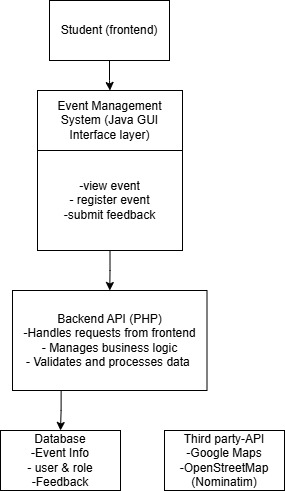
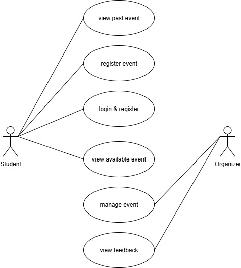

# Event-Management-System
**Introduction**

In the dynamic environment of academic institutions, organizing and managing student events can be a complex and time-consuming task. From scheduling and promotion to registration and attendance tracking, manual methods often lead to inefficiencies, miscommunication, and low participation. As students juggle their academic responsibilities with extracurricular interests, a centralized and user-friendly system becomes crucial to ensure effective event engagement and management.

This report presents the design and development of a Event Management System a digital solution aimed at streamlining the planning, organization, and participation in events across a university or college campus. By leveraging modern web technologies, this system intends to foster greater student involvement, enhance communication between organizers and participants, and reduce administrative overhead for clubs and student organizations.

**Project Overview**

The Student Event Management System is a platform designed to simplify the process of managing campus events. Its main goal is to provide a centralized hub where students can view available events, register for participation, receive notifications, and give feedback. Event organizers, such as student clubs or faculty members, can create and manage events, monitor attendee lists, and evaluate event success through collected data.

**Objective**

-To create a centralized and accessible platform for managing university or college events.

-To improve communication between event organizers and students.

-To increase student participation and engagement in campus activities.

**Problem Statement**

Currently, many student organizations rely on manual or disjointed digital tools such as social media, paper forms, or spreadsheets to promote and manage events. This leads to:

-Disorganization and confusion about event details.

-Low turnout due to ineffective communication.

-Difficulty tracking attendance and gathering post-event feedback.

The proposed system addresses these issues by offering a streamlined, user-friendly solution that benefits both students and event organizers, making campus life more interactive and well-managed.

**Solution of Problem Statement**

1. Centralized Event Dashboard:

-A unified interface displaying all upcoming events, categorized by type (academic, social, sports, etc.).

-Search and filter functions to help students easily find events of interest.

2.Automated Registration System:

-Students can register for events with a single click.

-Registration data is stored securely in a backend database for easy access by organizers.

3.Post-Event Feedback Collection:

-Feedback forms automatically sent to attendees after the event.

-Organizers can analyze responses to improve future events.

**Commercial Value / Third-Party Integration

Commercial Value**

Our Student Event Management System has the potential to be used in real-world situations, especially by colleges and universities. Many institutions still use manual methods or different platforms like social media or spreadsheets to manage their events, which can be messy and hard to keep track of.

With this system, everything is done in one place students can view, register, and get updates on events, while organizers can easily manage the event details and keep track of attendees. This can help schools save time, improve communication, and increase student participation.

In the future, this system could be turned into a product that is sold to different schools or organizations. It could even be improved to include mobile app support, social media sharing, or advanced features like attendance reports and feedback analysis.

Third-Party Integration
To make the system even better, we used some external APIs (Application Programming Interfaces) to add extra features.

Google Maps URI
We used Google Maps URI to help students easily find the location of events. For example, when a student clicks on the event location, it will open Google Maps and show directions from their current location.

Example:
https://maps.googleapis.com/maps/api/staticmap?center=%s&zoom=15&size=600x300&markers=color:red|%s&key=%s

Nominatim OpenStreetMap API
We also used the Nominatim OpenStreetMap API, which is a free service that helps convert place names or addresses into coordinates (latitude and longitude). This helps us map events or show them on a custom map in the system.

Example:
https://nominatim.openstreetmap.org/search?q=" + encoded + "&format=json&limit=1

By using these third-party services, our system becomes more useful and user-friendly, giving students clear directions to events and helping organizers plan better.

**System Architecture**

**Backend Application**

Technology Stack: The framework that we use in this project is PHP with phpMyAdmin SQL.

**API Documentation**

List of all API endpoints (HTTP method)

GET

-http://localhost/ems-api/organizerService/listEvents.php?organizer_id=?

-http://localhost/ems-api/organizerService/getFeedback.php?event_id=?

-http://localhost/ems-api/studentService/myEvents.php?student_id=?

-http://localhost/ems-api/studentService/getAvailableEvents.php?student_id=?

-http://localhost/ems-api/studentService/registeredEvents.php?student_id=?

-http://localhost/ems-api/studentService/pastEvents.php?student_id=?

POST

-http://localhost/ems-api/login.php 

-http://localhost/ems-api/studentService/registerStudent.php

-http://localhost/ems-api/organizerService/registerOrganizer.php

-http://localhost/ems-api/organizerService/createEvents.php

-http://localhost/ems-api/studentService/submitFeedbacks.php

-http://localhost/ems-api/studentService/registerEvents.php

PUT

-http://localhost/ems-api/organizerService/updateEvent.php

DELETE

-http://localhost/ems-api/organizerService/deleteEvent.php

**Frontend Applications**

**Frontend 1: Student Dashboard Application
Purpose**

This app is designed specifically for students to:

-View available events

-Register for events

-See a list of events they’ve already registered

-Submit feedback

It's a personalized interface that helps students keep track of their event participation.

**API Integration**

The student app communicates with the backend PHP API via HTTP requests.

StudentService is used to:

-Get the list of available events

-Get the student’s registered events

-Register the student for a selected event

**Frontend 2: Organizer Dashboard Application**

Purpose

This app is intended for event organizers or admins. Their tasks likely include:

-Creating and managing events

-Viewing student registration lists

-Updating or cancelling events

**API Integration**

The organizer app likely communicates with endpoints like:

organizerService/registerOrganizer.php

organizerService/createEvent.php

**Technology Stack**

-JavaFX: For building the graphical user interface (GUI)

-Java (Standard Edition): Core language

-HTTP & JSON: For making API calls to the organizer-side PHP backend

**Database Design**

The database is structured to separate different roles and responsibilities while keeping the data organized, scalable, and secure. It’s designed to support common features in an event management system such as user login, student registration, event creation, and feedback collection.

1. Users Table
Purpose: Stores basic login information (like name, email, password).

Reason: Both students and organizers are users, so this table avoids duplication and centralizes authentication.

2. Students Table
Purpose: Stores student-specific info (student number, course).

Relationship: Linked to Users using user_id.

Reason: Keeps student data separate from general user data. This allows adding more student-only features in the future.

3. Organizers Table
Purpose: Stores organizer-specific data (organization, phone).

Relationship: Also linked to Users via user_id.

Reason: Just like students, organizers need their own profile and control over event management.

4. Events Table
Purpose: Stores all event details (title, date, location, capacity).

Relationship: Linked to Organizers via organizer_id.

Reason: Every event must be created and managed by an organizer.

5. Registrations Table
Purpose: Tracks which students signed up for which events, including their registration status.

Relationship: Connects Students and Events.

Reason: A student can join many events, and each event can have many students — this is a many-to-many relationship, handled through this table.

6. Feedback Table
Purpose: Stores ratings that students give after attending events.

Relationship: Links back to both Students and Events.

Reason: Allows feedback to be traced to the right student and event.

**Business Logic and Data Validation**

**Use Case Diagram**

